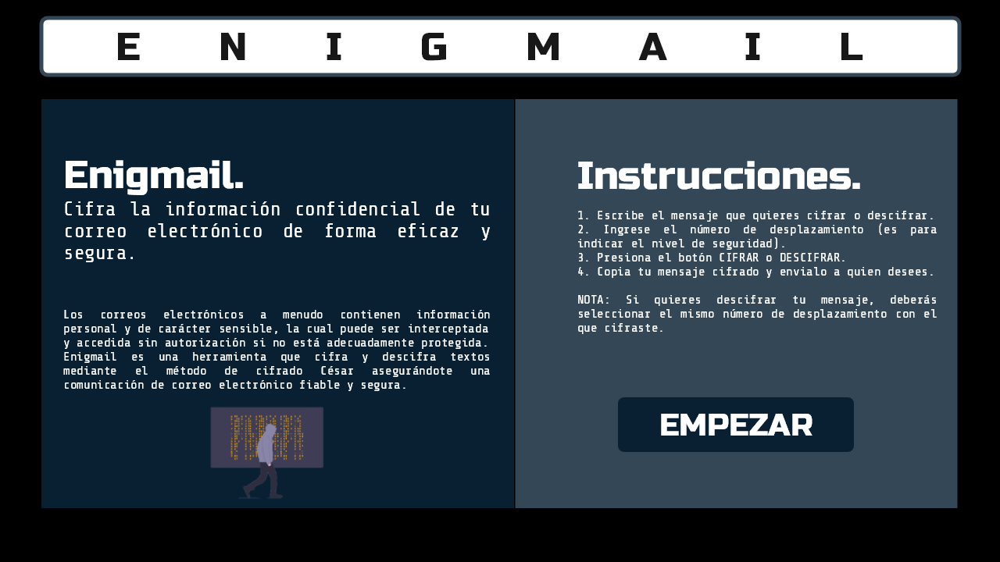
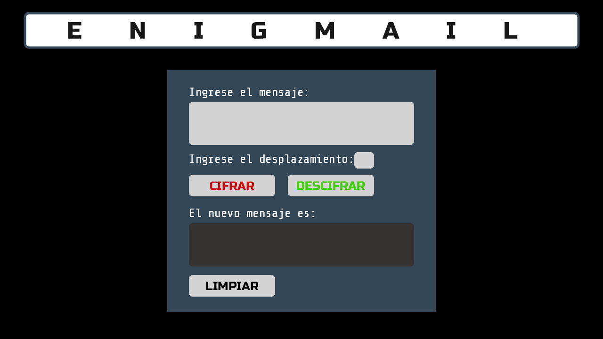
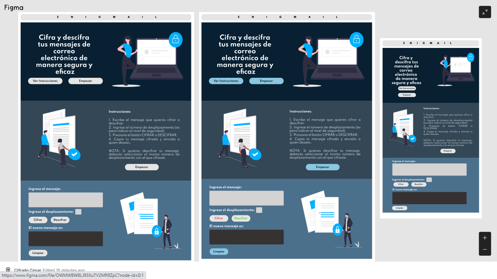

# Enigmail

## 1. Resumen del proyecto
Enigmail es una página web que cifra y descifra textos y números mediante el método de cifrado César asegurandote una comunicación de correo electrónico fiable y segura.

## 2. Definición del producto

### ¿Quiénes son los principales usuarios de Enigmail?
Desde personas que solo desean mantener el contenido de su mensaje protegido hasta las que laboran en empresas u organizaciones que tienen normas estrictas acerca de cómo comunicarse por correo electrónico, donde encriptar sus mensajes garantiza el cumplimiento de esos estándares.
### ¿Cuáles son los objetivos de los usuarios en relación con Enigmail?
Cifrar o descifrar los mensajes cuyos contenidos contienen informacion interna, personal o de caracter sensible, la cual puede ser enviada de manera errónea y accedida si no está adecuadamente protegida.
### ¿Cómo Enigmail está resolviendo los problemas de los usuarios?
Cifrando o descifrando la información confidencial del correo electrónico, así si alguien logra interceptar o acceder sin autorización, no podrá saber que dice ya que este estará encriptado, además de garantizar el cumplimiento de confidencialidad de algunas empresas u organizaciones.

## 3. Consideraciones generales
### Características del proyecto

El proyecto esta basado en el cifrado César, en el cual se sustituye una letra por otra que se encuentre cierto número de posiciones adelante o atrás, dentro del abecedario español sin considerar la ñ.

Acepta letras en mayúsculas o minúsculas, así como números pero con caracteres especiales y espacios retorna el mismo valor. 

El número de desplazamiento representa un número específico que indicará el número de saltos que dará cada letra para ser cifrada.
### ¿Cómo funciona Enigmail?
Al inicio de la página se muestra una sección de Bienvenida y verá dos botones: Ver Instrucciones y Empezar. Ver Instrucciones permite acceder a las instrucciones si es la primera vez que el usuario ingresa a la página. Por otro lado, Empezar lleva directamente a la zona de encriptación si ya ingresó antes y desea cifrar o descifrar su mensaje.

La sección de Cifrado/Descifrado permite al usuario:
* Insertar un mensaje (texto o número) que queremos cifrar.
* Elegir un desplazamiento indicando cuántas posiciones queremos que el cifrado desplace cada caracter.
* Ver el resultado del mensaje cifrado.
* Insertar un mensaje (texto o número) a descifrar.
* Ver el resultado del mensaje descifrado.

### Prototipo
El prototipo se realizó inicialmente en Lunacy y constaba de dos pantallas.

**Primera Pantalla**

**Segunda Pantalla**

### Hallazgos del prototipo
Después del primer sprint, gracias al feedback recibido por mis compañeras, se identificó que se debía establecer algunas mejoras en los siguientes aspectos:
- Facilitar el manejo de la interfaz para el usuario, es decir reducir cantidad de texto y dirigir la atención a la zona de cifrado o descifrado.
- Establecer una sola fuente de letra pero darle estilos para diferenciar títulos de textos regulares.
- Mejorar imágenes y fondo para que sea más amigable a la vista con el usuario objetivo.

Con los hallazgos anteriores, se realizó un nuevo prototipo esta vez realizado en [Figma](https://www.figma.com/). Los prototipos fueron para dos dispositivos diferentes pues se queria que la interfaz presentara el efecto smooth scroll y sea con diseño adaptable.

